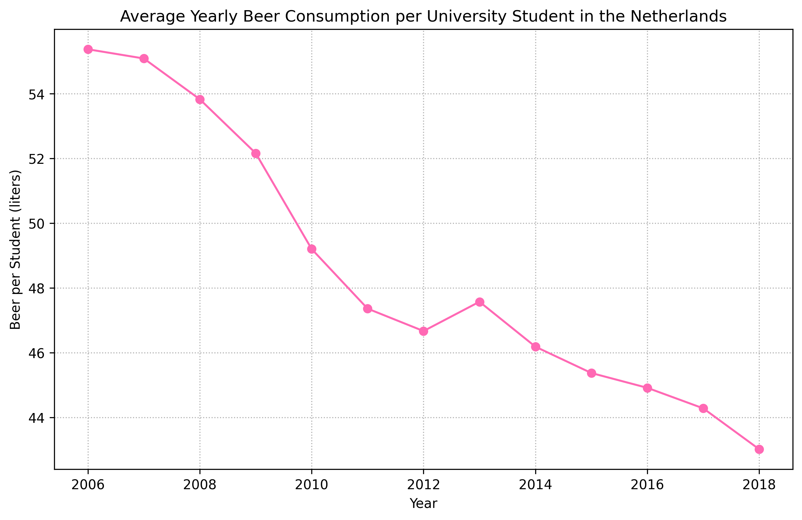

13696475

Fantastic yeasts and where to find them: the hidden diversity of dimorphic fungal pathogens  
An analysis of the forces required to drag sheep over various surfaces  
The neurocognitive effects of alcohol on adolescents and college students

The graph shows the average yearly beer consumption per university student in the Netherlands from 2006 until 2018. In the year 2006 the average beer consumption is at about 55 liters per student. Over the years, the beer consumption decreased, reaching approximatly 43 liters per student in 2018.
